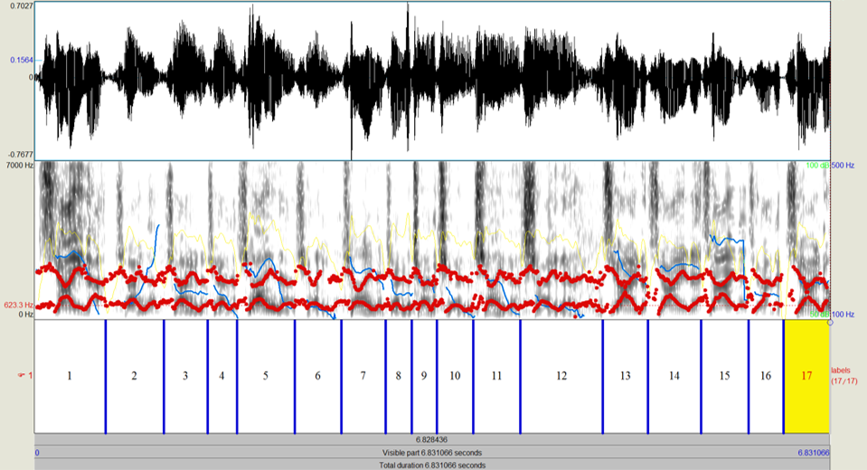

## You think it's easy?

You really think it's easy to recognize speech? Let's hear what this person has to say about recognizing speech:



> 
Generated in Google Flow; model: Omni Flash; date: May 27, 2026.

Prompt: *A cinematic, medium close-up shot from the front of a man sitting in front of a green screen, behind an office desk. He is looking casual. He is holding and staring down at a single, crisp white sheet of paper. In a single, fast, and incredibly sloppy burst of speech, without any pauses, he strings the words together to say, "it's not easy to wreck a nice beach" (sounding phonetically like "itsnoteasytowreckanicebeach"). Immediately after he finishes speaking, the camera operator walks over in a natural motion to behind and over his shoulder. The camera focuses sharply on the paper in his hands, revealing the text printed clearly in a clean, legible font: "it's not easy to wreck a nice beach". Photorealistic, professional cinematic lighting, natural motion blur during the camera movement, 4k resolution, seamless audio-to-video synchronization.*


You think you know what he's saying until... you see the words he's actually been reading. Surprise!

Most of us have conversations with people all day and we hardly ever find comprehending what they're saying particularly difficult, right? Only in the most challenging circumstances do we conciously struggle, like when talking in loud background noise. This at times makes us underestimate how challenging speech perception really is.

Understanding what someone else is saying is actually an incredible achievement of the human brain. But it can be challenging to convince people that recognizing speech is truly remarkable. Here's my attempt by guiding you past **four exhibits**:

  

## **Exhibit #1**: same speech, different words

Did you know the same clip can be heard as two completely different words? Check out this clip:

> Laurel/Yanny -- [original]

> 





The internet exploded over this audio clip in 2018 because people got into heated arguments about whether what you're hearing is the name **Laurel** or the name **Yanny**. This is called a 'bistable clip' or a 'polyperceivable word' and other examples were soon found, like the next one. It's perceived as **brainstorm** some of the time, but as **green needle** on other occasions. Just play it a couple of times. For me, even just thinking about one of the two options can change what I'm hearing!

> Brainstorm/Green Needle -- [original]

> 
https://archive.thetab.com/uk/2018/05/18/brainstorm-or-green-needle-why-can-i-hear-both-explained-65537


Still, you might say:

** *Well, this is all artificial speech. Real speech produced by humans is much clearer.* **

But there are lots of examples of human-produced speech that are similarly enigmatic (...there's even a [webpage](https://theory.stanford.edu/~valiant/polyperceivable/index.html) logging some of these). For instance, have you ever experienced listening to a new song and hearing the strangest of lyrics? Like: why is Lady Gaga singing **Gotta pee, okay?** in her hit 'Just Dance'? And there are more of such [mondegreens](https://en.wikipedia.org/wiki/Mondegreen):

| Misheard | Original | Source |
| -------- | -------- | ------ |
| *English:* | | |
| "Gotta pee, okay?" | "Gonna be okay" | Just Dance, Lady Gaga | 
| "Pair of... pair of... pair of dice"  | "para-, para-, paradise" | Paradise, Coldplay |
| "I’m your penis..." | "I'm your Venus..." | Venus, Shocking Blue |
| "Obama's elf" | "All by myself" | All By Myself, Eric Carmen | 
| "José, can you see" | "O say can you see... | American national anthem |
| "The girl with colitis goes by" | "The girl with kaleidoscope eyes" | Lucy in the Sky with Diamonds, The Beatles | 
| "Dancing queen, feel the beat, on the tangerine..." | "Dancing queen, feel the beat, from the tambourine..." | Dancing Queen, ABBA |
| "I’m blue, I'm in need of a guy..." | "I'm blue, dabadee, dabadai" | Blue, Eiffel65 |
| *Dutch:* | | |
| "Mama, appelsap" [Eng. Mommy applejuice] | "Mama-say mama-sa ma-ma-ko-ssa" | Wanna Be Startin' Somethin', Michael Jackson | 

Don't believe me? Just watch this:



 

OK, so the same speech can actually be perceived as completely different words.

Does the reverse also hold: same words, different speech?

## **Exhibit #2**: same words, different speech

The same word can be pronounced in a zillion different ways. Think of differences in pronunciation between native and non-native speakers, differences between dialects, men vs. women, the voices of kids vs. adults, and so on.

But the same word comes out differently even **for one and the same talker**:



 

Let's take a closer look at just 17 instances of Trump's "China". The blue lines at the bottom of the image below indicate where one "China" ends and the next one starts. Conclusion: **they are all acoustically different**. Some are long, others are short. Some are loud, others more quiet. Some are high-pitched, others low... and yet we perceive the same word over and over again?!?

And it gets even worse...

## **Exhibit #3**: sloppy speech is worse

The words we exchange when we have a conversation don't come out nicely spaced apart. Instead we string them together into one long continuous sound stream. This makes picking out words from that stream quite challenging. **Listen to this clip and see if you can recognize the word.**



That was tough, right? You probably only recognized the word when the full sentence was played. Now, I hear you thinking:

** *"Well, that's obvious. I simply use the context to get the word right."* **

...and you wouldn't be wrong. Hearing a word in context is much easier than hearing it cut out from its natural habitat (as this example demonstrates). **Still, it's too simplistic to think that context solves all our problems.** Many contexts are not particularly helpful for predicting what'll come next. "My momma..." could have continued with just about anything.

Also, if context helps to recognize the next word, how did you recognize the context itself then? The first words in the sentence don't have any preceding context and still you recognize them, right? *Really? You sure?* You really think the first words were "My momma..." in this clip? [IMDB](https://www.imdb.com/title/tt0109830/quotes/?item=qt0373657&ref_=ext_shr_lnk) at least says so. But listen again and you'll find it's closer to "ma-mam".

In fact, the speech we hear on the news, in university lectures, and in audiobooks is not very representative of the speech we hear most of the time. Speech in spontaneous conversations is **much more sloppy**: vowels become less clear, consonants change, and sometimes even entire syllables or words disappear. **I do not know** becomes **I don't know, I dunno, dunno, or even hm-mm!** Listen to these examples from Prof. Natasha Warner's [webpage](https://sites.arizona.edu/nwarner/reduced-speech-examples/).

> *She wants to be a police officer, I think*


> > --> ...where "She wants to be a..." comes out as "shuh-zi"!


> *As like parttime, I can't remember what they called it...*


> > --> ...where "can't remember what..." comes out as "kam bruh"!


Therefore, it's actually surprisingly difficult to correctly write down the words from an audio clip. Even when you are given video clips, where you can indeed *hear and see* the talker speak, you can still have error rates of ca. 15% (see Table 5 in [Guan & Valiant, 2019](https://doi.org/10.48550/arXiv.1906.01040)).

## **Exhibit #4**: worst-case scenarios

You thought those earlier clips were hard to recognize? There's worse.

**Speech is typically not heard in a void.** We can chat with our friends in a busy bar, we're on the phone while the kids are talking in our other ear, we can multitask listening to a podcast while driving a car, we can deal with echo-y speech inside a large cathedral, we can recognize whispers as well as shouting, and even talkers with a foreign accent.

> Can you follow the lady's voice?

> 
Adaptation of [original recording](https://en.wikipedia.org/wiki/File:Recording_of_speaker_of_British_English_(Received_Pronunciation).ogg) (IPA, CC-BY-SA 3.0), using SFX from Elevenlabs and Praat.


In all of these scenarios, the speech sounds different. This can make listening hard. In fact, as people get older and their hearing worsens, these situations become the first instances where they notice trouble communicating.

# But AI can recognize speech just fine

You sure?



 

Well... to be honest, AI can do speech recognition very well these days. Nevertheless, there are still scenarios where humans are fine and AI fails. For example, humans can code-switch between languages effortlessly, starting a sentence in English and ending it in Spanish, while AI struggles with different languages within one and the same utterance. Similarly, humans can easily track who's talking when, while AI may confuse the target talker with a competing talker in the background.

But I hear you thinking:

** *"Well, in a year or two, AI will be able to deal with that too."* **

...and you may be right (or not). Even if AI were to reach comparable word recognition performance to humans, the crucial distinction remains that **AI accomplishes this through fundamentally different mechanisms**. An analogy:

Humans can swim under water. Submarines can also operate under water. But noone would say that submarines swim, right?

It's a bit like that. AI systems can only recognize words because they've been trained on truckloads and truckloads of speech recordings, often with accompanying (human-generated!) transcripts. Indeed, some systems have been trained by playing them an entire lifetime of speech! Us humans, however, can already understand (some) words when we're only 6-months old, with much less training. Therefore, even if speech recognition performance (i.e., external behavior) were to become comparable between AI systems and humans, how we achieve this kind of behavior is qualitatively dissimilar (i.e., internal mechanisms).

> 
The difference between AI-driven and human speech recognition is nicely illustrated by a clever speech trick: 'repackaging' speech. This involves compressing speech (i.e., speeding it up artificially), thereby making it impossible to understand. But then you intersperse very short silent gaps into the compressed signal... et voilá: intelligibility is restored. Try it yourself in [this other demo](../repackaging).

This speech trick works well for humans, because the silences give the brain some 'breathing space'. However, AI systems fail terribly when they're fed this kind of 'repackaged speech' (see [Adolfi et al., 2023](https://doi.org/10.1016/j.neunet.2023.02.032)). This is because they haven't been trained on this kind of quirky speech, revealing distinct processing mechanisms between humans and AI.



# So how come it still seems so easy?

If speech recognition in everyday life is really that remarkable, then how come it seems so easy?

**Because humans are clever.** We can predict what word is gonna come next ([demo](../visual-world-paradigm)), we can compensate for acoustic specs in the surrounding context ([demo](../conjuring-words) and another [demo](../laurel-yanny)), we can selectively attend to one talker while ignoring others ([demo](../cocktail-party)), we can adapt our voice and our ears to the listening situation at hand ([demo](../lombard-speech)), we can help our ears by 'listening with our eyes' ([demo](../manual-mcgurk)), and so on.

What is a challenging process becomes remarkably smooth thanks to our brain's exceptional toolbox for interpreting speech.

# Why are you telling me all this?

Because it underscores the need for research into human speech perception. The human brain is unique in its ability to recognize speech (almost) effortlessly; yet, how exactly it does so remains unclear. We know parts of the human toolbox for comprehending speech but we don't have the full picture yet. By studying the intricacies of speech perception, we may be able to better understand this unique aspect of human nature. Also, it could inspire better AI speech recognition, and may even help those who struggle with spoken communication, due to aging and hearing loss.

So, all in all, I hope you're now convinced that:

> What speech is like, then, is: not immediately transparent for the listener. Speech is fast, continuous, variable, and nonunique.

> Anne Cutler, *Native Listening*, 2012, p.39

## Relevant lab papers

> 

> 

> 
