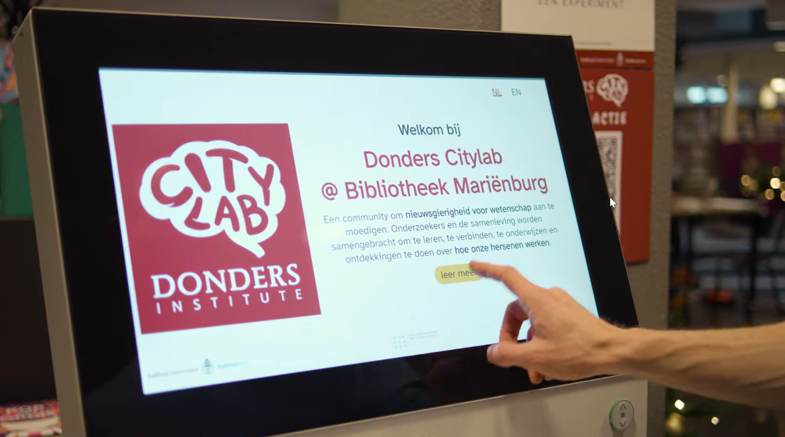
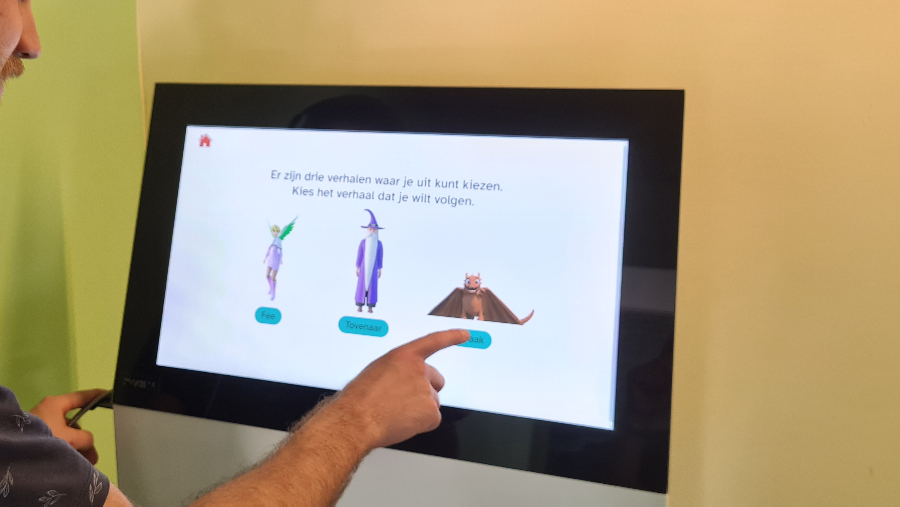
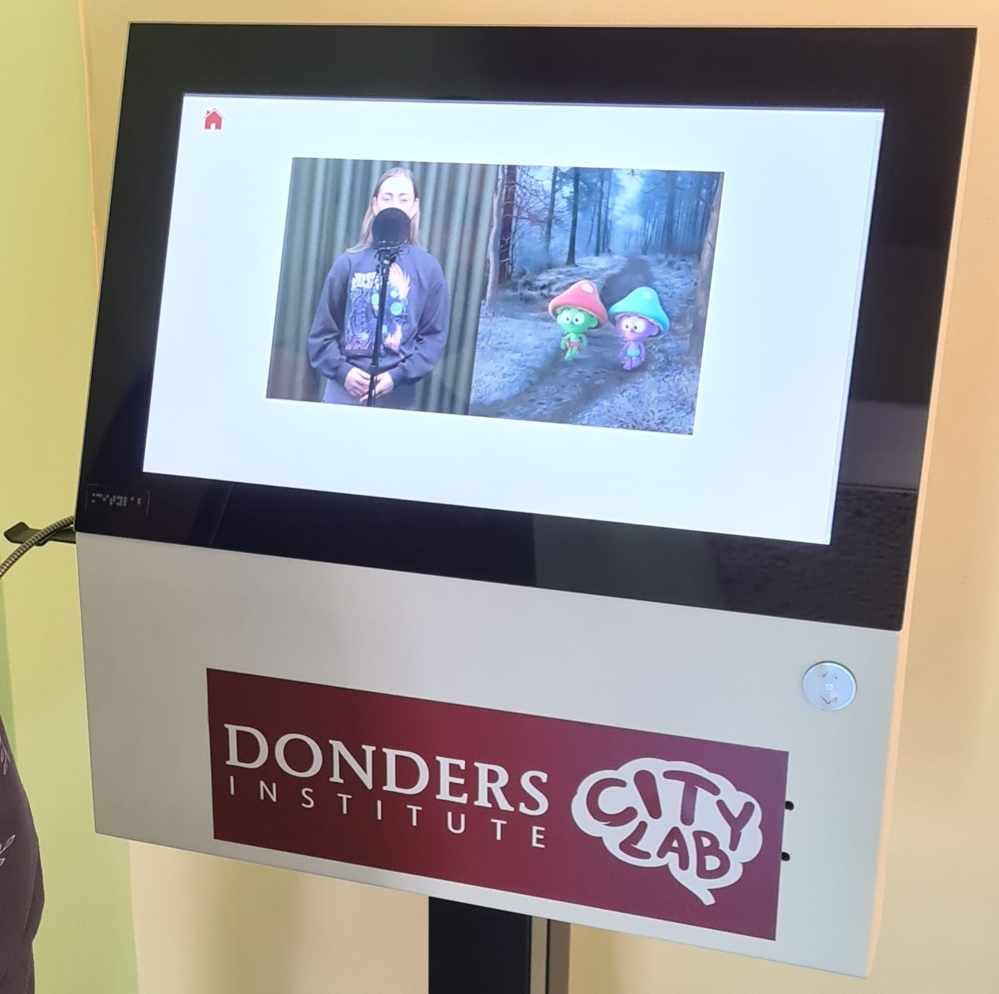
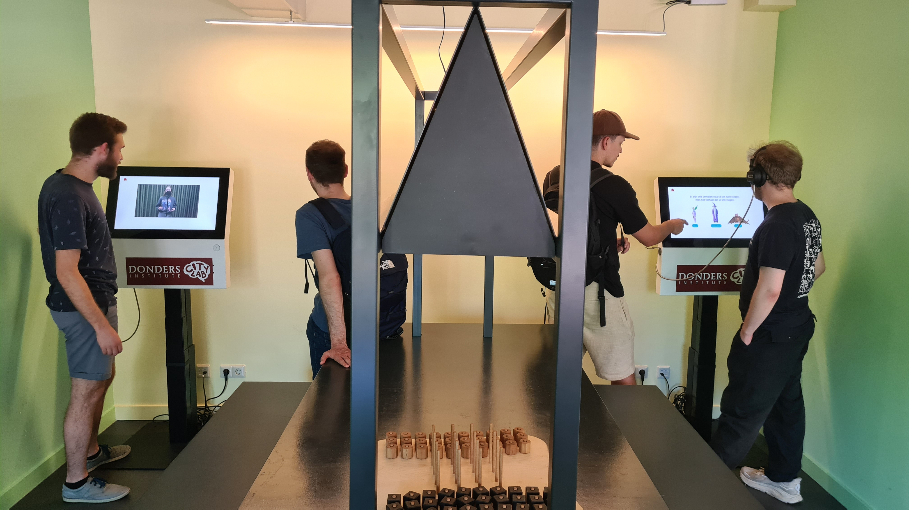
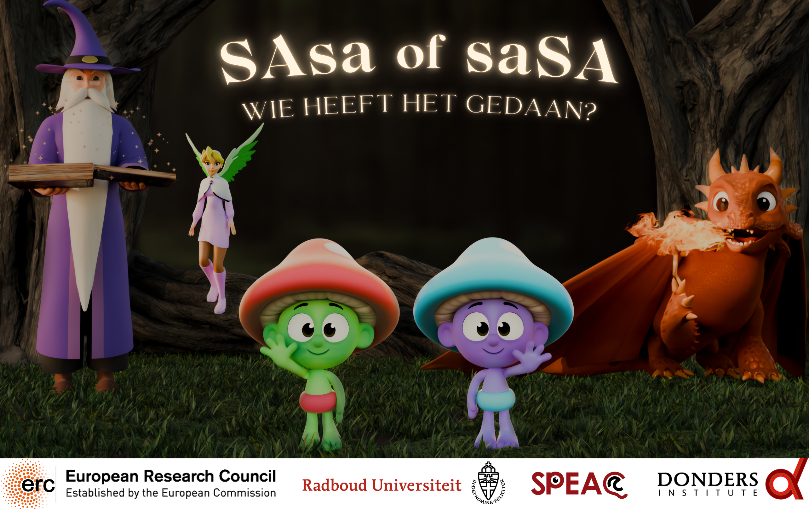

**Our demo for the Donders Citylab is NOW LIVE. Watch the adventures of our two little friends "SAsa" and "saSA" right here, and decide: who dunnit?**

<!--more-->

## Citizen science

At the [Donders Citylab](https://www.ru.nl/en/donders-institute/services/donders-citylab) sites, you can learn all about how humans think, see, feel, and hear. Through the Citylab, researchers from the Donders Institute are bringing their science out of the lab and into the community. Citylab sites are scattered all around the city of Nijmegen, such as inside a museum or a public library.

## Try our mini-tests

One of the ways in which people can engage with science at the Citylab is through small mini-tests, presented on a touchscreen interface. These mini-tests are short, interactive, and quite fun. Their aim is to allow people to explore the mysteries of the human brain and behavior, while at the same time collecting data for real research. For example, you can learn all about the power of your imagination, or about how your expectations shape what you see (or don't see).

## Meet SAsa and saSA

Our own mini-test is about **how to listen with your eyes**. It's a short 2-minute demo in Dutch, in which a narrator introduces you to two little friends: *SAsa and saSA*. These friends find themselves in all sorts of extraordinary adventures, meeting fairies, wizards, and even a dragon. But watch closely! Because every now and then the narrator will ask you: **"who dunnit, was it SAsa or saSA?"**

## ▶ Watch it NOW!

The demo with SAsa and saSA is now live at the various Donders Citylab sites. But you can also take a peak on your own device. Just **click the banner below** to watch the adventures of SAsa and saSA yourself!

Keep in mind though: **all instructions and video content are in Dutch!**

